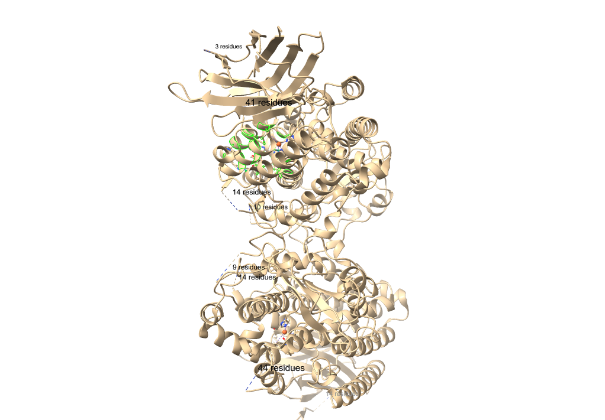
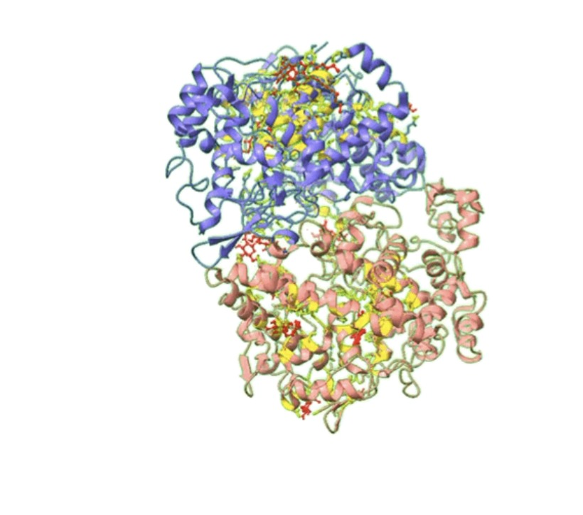

# 🧬 Pipeline Computacional de Docking Molecular & Triagem de Alvos

Estudo estrutural *in silico* focado na simulação, ancoramento e predição de afinidade ligando-proteína. O projeto aplica métodos de bioinformática e modelagem computacional para identificação de cavidades ativas, caracterização de interações intermoleculares e suporte à triagem de candidatos terapêuticos.

---

### 🎯 Objetivos Estratégicos & Técnicos
* Modelar e parametrizar alvos macromoleculares terapêuticos (5-LOX e COX-1).
* Identificar cavidades ativas e delimitar caixas conformacionais (*grid box*).
* Otimizar ligantes candidatos e avaliar conformações de menor energia livre.
* Mapear interações químicas críticas (pontes de hidrogênio e contatos hidrofóbicos).

---

### 🔬 Metodologia & Pipeline de Análise
1. **Preparação Estrutural:** Limpeza de estruturas cristalográficas, ajuste de protonação e cálculo de cargas parciais.
2. **Docking & Cálculo de Afinidade:** Ancoramento semi-flexível e pontuação termodinâmica de sítios de ligação.
3. **Análise Pós-Docking:** Verificação de sobreposição conformacional (RMSD) e validação geométrica.

---

### 🎥 Resultados Visuais & Simulações Estruturais

#### 1. Mapeamento do Sítio Ativo e Resíduos Catalíticos (5-LOX)
Inspeção conformacional do alvo 5-Lipoxigenase, destacando os resíduos de aminoácidos responsáveis pela estabilização e ancoragem do ligante.

---

#### 2. Dinâmica Macromolecular e Subunidades Catalíticas (COX-1)
Visualização tridimensional das subunidades e conformações espaciais favoráveis da Ciclo-oxigenase 1.

---

#### 3. Otimização Conformacional e Geometria do Ligante Candidato
Parametrização e conformação de estrutura molecular ramificada para suporte aos ensaios de afinidade.

79695683-7610-402f-8681-ebb5961

---

### 📁 Acesso aos Vídeos de Simulação em 3D
As rotações dinâmicas completas das macromoléculas em alta resolução podem ser visualizadas diretamente na pasta de demonstração:

👉 **[Acessar Demonstrações e Rotações 3D no Google Drive](https://drive.google.com/drive/folders/1xhFHu86IT0DIuiPRG4fUuGEqlxqCnV8Z?usp=sharing)**

---

### 💼 Aplicação em Inovação & Medicina de Precisão
A triagem prévia *in silico* de alvos correlacionados a vias inflamatórias e microambientes teciduais otimiza o ciclo de validação de biomarcadores e candidatos terapêuticos. Essa abordagem computacional reduz o custo de bancada de P&D e fornece a fundamentação analítica para o desenvolvimento de soluções integradas, como a arquitetura de dados e biossensores proposta no projeto **OncoChip**.

---

📫 **Autora:** Clara Manhães — [LinkedIn](https://www.linkedin.com/in/clara-manhães-dados)
